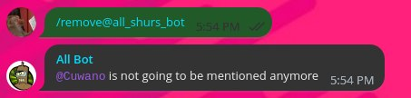

# AllShursBot

[@all_shurs_bot](https://t.me/all_shurs_bot)

# Setup in a chat

Add the bot to any chat and give him access to messages

Send `/register` in the group and click the `Register!` button

# Usage

Mention every registered member by starting a message with:
  - `@here`
  - `@all`
  - `@shures`
  - `@todos`

# Stop beeing mentioned

If you don't want to be mentioned by the bot no more, send `/remove`

